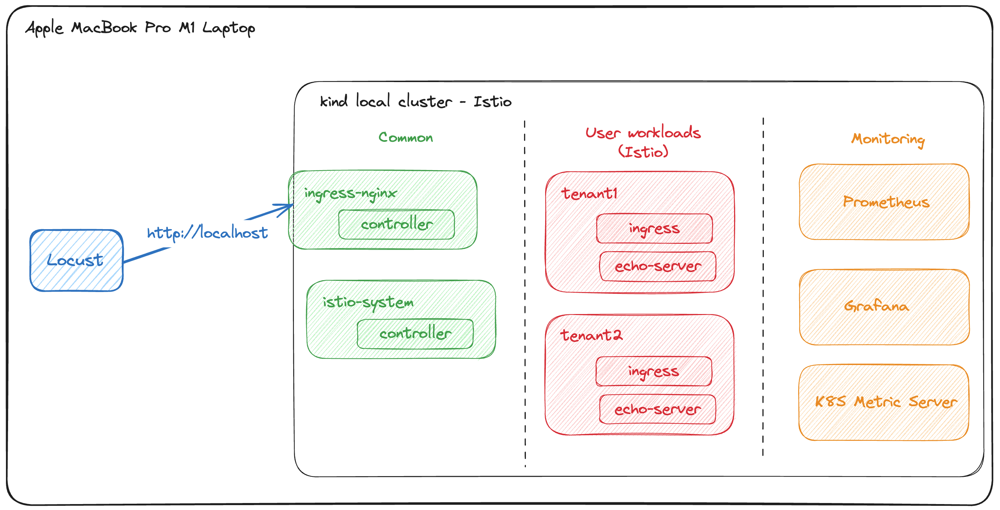
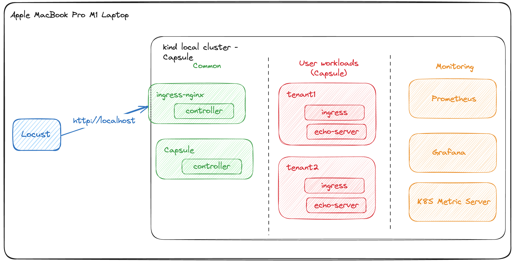

# Kubernetes Multi-Tenancy: Capsule vs Istio Service Mesh

## Overview

This code is part of the research I conducted for my Masters in Software Solutions Architecture at Technological University Dublin, Ireland.

## Research Outline & Objective

Kubernetes is the leading container orchestration platform today. To optimize Kubernetes usage, enterprises often share Kubernetes clusters across multiple tenants. This is achieved by sharing one or multiple Kubernetes namespaces.

Namespace isolation is frequently implemented using Istio Service Mesh. However, there's literature highlighting the overhead of running Istio service mesh on a cluster.

Consequently, this research aimed to implement a similar namespace-based tenant isolation model using the Capsule operator for Kubernetes and compare the metrics against the Istio service mesh-based implementation.

## Research Findings

* Workloads with Capsule operator was up to **11%** points less resource intensive.
* Workloads with Capsule operator performed **545** more Request Per Second (RPS).
* Workloads with Capsule operator responded **2ms** faster.

## Research Setup

**Istio Cluster Setup**

**Capsule Cluster Setup**

## Replicating the Setup

### Tools Used

* [Kind](https://kind.sigs.k8s.io/) - local Kubernetes cluster
* [Helmsman](https://github.com/Praqma/helmsman) - Infrastructure-as-code (IaC) for managing Helm chart installations
* [Locust](https://locust.io/) - python-based load testing tool
* [Istio Service Mesh](https://locust.io/)
* [Capasule Operator](https://capsule.clastix.io/)

### Steps to Replicate

* Steps and commands to replicate the Istio service mesh-based cluster setup - [link to setup instructions](./istio-cluster-setup.md)
* Steps and commands to replicate the Capsule operator-based cluster setup - [link to setup instructions](./capsule-cluster-setup.md)

## Research Poster (PDF)

[Link to Research Poster](./Research_Poster.pdf)

## Contact

For further details, feel free to contact me at:

* Email: soorajshajahan@ymail.com
* LinkedIn: [Link to LinkedIn Profile](https://www.linkedin.com/in/soorajshajahan/)
